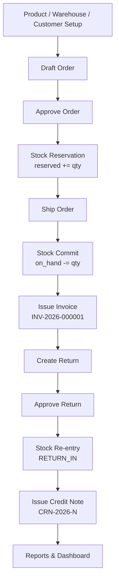

# B2B Operations Suite

> Sipariş, stok, depo, müşteri, fatura, iade ve raporlama süreçlerini yöneten full-stack B2B operasyon yönetim sistemi.

Bu proje, gerçek bir şirket içi operasyon panelinin (back-office) mantığıyla tasarlanmış,
**modüler monolit** mimaride bir B2B yönetim sistemidir. Sadece CRUD değildir; **stok
rezervasyonu, sevkiyat sırasında stok düşümü, gapless fatura numaralandırma, iade ve credit
note** gibi gerçek finansal/envanter iş kuralları uçtan uca uygulanmıştır.

Sistem; **stok doğruluğu, finansal bütünlük ve denetlenebilirlik (auditability)** kavramlarını
birinci sınıf gereksinim olarak ele alır — stok ve para asla "yaklaşık" değildir. Doğruluğun tek
kaynağı PostgreSQL'dir; kritik iş işlemleri tek bir veritabanı transaction'ı içinde, satır
seviyesinde kilitle yürütülür.

Davranış için tek doğruluk kaynağı [PROJECT_SPEC.md](PROJECT_SPEC.md) ve [`docs/`](docs/)
altıdır; bu README bunların üzerine kurulu bir tanıtım ve operasyon rehberidir.

---

## İçindekiler

1. [Durum ve kanıtlar](#1-durum-ve-kanıtlar)
2. [Özellikler](#2-özellikler)
3. [Uçtan uca iş akışı](#3-uçtan-uca-iş-akışı)
4. [Teknoloji yığını](#4-teknoloji-yığını)
5. [Mimari](#5-mimari)
6. [Öne çıkan mimari kararlar](#6-öne-çıkan-mimari-kararlar)
7. [Frontend ekranları](#7-frontend-ekranları)
8. [Backend API modülleri](#8-backend-api-modülleri)
9. [Test ve kalite kanıtları](#9-test-ve-kalite-kanıtları)
10. [Manuel test özeti](#10-manuel-test-özeti)
11. [Kurulum](#11-kurulum)
12. [Demo akışı](#12-demo-akışı)
13. [Bilinen sınırlamalar](#13-bilinen-sınırlamalar)
14. [Gelecek geliştirmeler](#14-gelecek-geliştirmeler)
15. [CV / Portfolio özeti](#15-cv--portfolio-özeti)
16. [Güvenlik uyarısı](#16-güvenlik-uyarısı)

---

## 1. Durum ve kanıtlar

Demo milestone'u tamamlanmış ve **gerçek PostgreSQL 16** üzerinde son kez doğrulanmıştır.

| Gösterge                  | Durum                              |
| ------------------------- | ---------------------------------- |
| Final demo-ready          | ✅                                 |
| Backend API gate          | ✅ 576/576 (0 skipped)             |
| Database gate             | ✅ 133/133 (0 skipped)             |
| Web tests (Vitest/RTL)    | ✅ 180/180                         |
| E2E smoke (Playwright)    | ✅ 19/19                           |
| Manuel tam-stack test     | ✅ GEÇTİ                           |
| Veritabanı                | ✅ Gerçek PostgreSQL 16            |

> **Demo-ready ≠ release-ready.** Yukarıdaki backend gate'leri release onayının zorunlu
> koşuludur ve fail-closed'dur (erişilebilir PostgreSQL yoksa yanlış-yeşil dönmez, non-zero
> çıkar). Production öncesi yapılması gerekenler için bkz. [§13](#13-bilinen-sınırlamalar) ve
> [§16](#16-güvenlik-uyarısı).

Detaylı durum: [docs/reviews/FINAL_PROJECT_STATUS.md](docs/reviews/FINAL_PROJECT_STATUS.md) ·
Release değerlendirmesi:
[docs/reviews/FINAL_RELEASE_READINESS_REVIEW.md](docs/reviews/FINAL_RELEASE_READINESS_REVIEW.md)

---

## 2. Özellikler

### Auth & Security
- E-posta/şifre ile login, logout, oturum (session) yenileme (rotating refresh token + reuse
  detection).
- Argon2id ile parola saklama (OWASP uyumlu parametreler); HS256 imzalı kısa ömürlü access token.
- Parola sıfırlama akışı: token AES-256-GCM ile mühürlenir (raw token DB'de plaintext tutulmaz).
- Hesap kilitleme (account lockout) **PostgreSQL'de otoritatif**; Redis tabanlı login throttle
  ikincil savunmadır ve Redis yoksa fail-open çalışır.
- **Deny-by-default:** token'sız her korumalı istek `401 UNAUTHENTICATED`.
- RFC 7807 `application/problem+json` hata sözleşmesi + stabil `code` + `requestId` korelasyonu.
- Strict DTO whitelist doğrulaması: bilinmeyen alan/parametre reddedilir (`400 VALIDATION_ERROR`).

### RBAC / Tenant Isolation
- **Permission tabanlı RBAC** (rol-adı dallanması yok; her zaman effective permission çözümü).
- Şirket (company) kapsamlı kullanıcı/rol/permission modeli — **multi-tenant**.
- Yetkilendirme JWT claim'ine güvenmeden her istekte veritabanından çözülür.
- **Warehouse scope:** hiçbir rol implicit (örtük) global depo erişimi vermez — ADMIN dahil. Depo
  erişimi yalnız açık `user_warehouse_scopes` satırı veya protected `warehouse:scope:all`
  permission'ı ile gelir.
- **Grant ceiling:** ADMIN kendi yetkisini yükseltemez, protected rol/permission atayamaz, sahip
  olmadığı yetkiyi başkasına veremez.
- Authorization cache + version yaklaşımı (rol/permission değişiminde tutarlı invalidasyon).
- Cross-company (tenant) sızıntısına karşı entegrasyon testleri.

### Product Management
- Ürün listeleme, oluşturma, düzenleme, silme (soft delete).
- CSV import / export.
- CSV export'ta **formula injection** nötralizasyonu (`=`, `+`, `-`, `@` ile başlayan hücreler).
- BigInt-safe para gösterimi (JS `number` ile para hesaplanmaz).

### Warehouse Management
- Depo CRUD; active/inactive durum.
- Şirket kapsamlı `code` benzersizliği.
- Warehouse scope ile uyumlu (kullanıcı yalnız erişimi olan depoları görür).

### Customer Management
- Müşteri CRUD; `COMPANY` / `INDIVIDUAL` tipleri.
- Tip ve arama bazlı filtreleme; alan doğrulaması (geçersiz tip reddedilir).

### Stock Management
- Stok düzeltmeleri (adjustments) — `Idempotency-Key` ile.
- Append-only **stock ledger** (hareketler asla güncellenmez/silinmez — DB trigger engeller).
- `on_hand`, `reserved`, `available = on_hand − reserved` ayrımı; DB CHECK ile negatife düşmez.
- Depolar arası **stock transfer** temeli (atomik iki-bakiye, sıralı kilit, kaynak/hedef scope).
- Envanter raporu (depo bazlı stok bakiyeleri).

### Order Lifecycle
Sipariş durum makinesi: `DRAFT → APPROVED → PREPARING → SHIPPED` ve (SHIPPED hariç herhangi bir
noktadan) `CANCELLED`.

- Draft sipariş oluşturma / düzenleme / iptal (DRAFT-only PATCH + expected-status guard).
- **Onayda stok rezervasyonu** — all-or-nothing: yetersiz stokta tam reddi, sipariş DRAFT kalır.
- **Sevkiyatta stok düşümü** — `on_hand −= qty` ve `reserved −= qty` birlikte, ledger'a `SHIPMENT`.
- Fiyat/vergi/toplam **server tarafında** hesaplanır (`products.list_price`); client fiyat/total
  gönderemez (reddedilir). İndirim yalnız `order:price:override` + reason + audit ile.
- Kritik mutasyonlar (`ship`, `invoice`) `Idempotency-Key` ile çift-gönderime karşı korunur.
- SHIPPED sipariş iptal edilemez → iade süreci kullanılır.

### Invoice
- SHIPPED siparişten fatura üretme (`ISSUED`).
- **Gapless (boşluksuz) fatura numarası:** PostgreSQL `sequence` yerine kilitli `invoice_series`
  sayaç tablosu — rollback durumunda numara "yanmaz". Format `INV-<yıl>-N`.
- `Idempotency-Key` ile tekrarlı faturalandırmaya karşı koruma.
- Fatura listesi + detay drawer (BigInt-safe tutarlar).

### Returns & Credit Notes
- SHIPPED siparişten iade oluşturma.
- İade onayı (`REQUESTED → APPROVED`) sırasında depo yaşam döngüsü **kilit altında** revalide
  edilir.
- Onaylı iadede stok geri girişi (resellable ise `RETURN_IN`).
- Credit note kesme: APPROVED iade → `CRN-<yıl>-N`; **orijinal fatura zorunlu** (yoksa 422).
- Credit note listesi + detay UI.

### Dashboard & Reports
- Dashboard summary kartları (ürün/müşteri/sipariş/fatura sayıları + günün satışları).
- Satış (sales), envanter (inventory) ve iade (returns) raporları.
- BigInt-safe miktar/para gösterimi.
- Tenant-güvenli rapor sorguları (raporlar yalnız ilgili şirketin verisini döndürür).

---

## 3. Uçtan uca iş akışı



1. **Kurulum verisi:** ürün, depo ve müşteri oluşturulur; stok düzeltmesiyle depoya stok girilir.
2. **Draft sipariş:** kalem fiyatları server'daki `list_price`'tan okunur (client'tan değil).
3. **Onay:** stok all-or-nothing rezerve edilir; yetersiz stok varsa onay tamamen reddedilir,
   sipariş DRAFT kalır.
4. **Sevkiyat:** rezerve stok commit edilir — `on_hand` düşer, `reserved` serbest bırakılır,
   ledger'a `SHIPMENT` yazılır.
5. **Fatura:** SHIPPED siparişten gapless numaralı `ISSUED` fatura üretilir.
6. **İade:** SHIPPED siparişe karşı iade açılır; onayda depo durumu kilit altında revalide edilir
   ve stok geri girer.
7. **Credit note:** onaylı iadeden, orijinal faturaya bağlı credit note kesilir.
8. **Raporlama:** dashboard ve satış/envanter/iade raporları akış sonrası canlı güncellenir.

Her adım sunucu tarafında **permission + warehouse scope** ile yetkilendirilir; UI yalnız
kullanıcının yapamayacağını gizler.

---

## 4. Teknoloji yığını

### Frontend
| Teknoloji            | Sürüm / Not                          |
| -------------------- | ------------------------------------ |
| Next.js (App Router) | 14.2.21                              |
| React                | 18.3.1                               |
| TypeScript           | 5.6.3 (strict, `noUncheckedIndexedAccess`) |
| Tailwind CSS         | Tasarım token'ları `@b2b/ui` içinde  |
| Vitest + Testing Library | Birim/komponent testleri         |
| Playwright           | 1.49.1 (E2E smoke)                   |

### Backend
| Teknoloji      | Sürüm / Not                                   |
| -------------- | --------------------------------------------- |
| NestJS         | 10.4.15 (REST, `/api/v1`)                     |
| TypeScript     | 5.6.3 (strict)                                |
| Prisma         | 5.22.0 (forward-only migration)               |
| PostgreSQL     | 16 (doğruluğun tek kaynağı)                    |
| JWT            | HS256 access + rotating refresh               |
| RFC 7807       | `problem+json` + stabil error code            |
| Idempotency    | `Idempotency-Key` header pattern              |
| argon2id       | `hash-wasm`                                   |
| OpenAPI/Swagger| `@nestjs/swagger` (dev'de explorer)           |

### Monorepo / Tooling
| Teknoloji   | Sürüm / Not                                       |
| ----------- | ------------------------------------------------- |
| pnpm        | 9.15.0 (workspace)                                |
| Turborepo   | 2.3.3 (görev orkestrasyonu + cache)               |
| Prisma migrate | Şema + elle SQL (CHECK/trigger/partial-unique) |
| ESLint      | Frontend→DB sınır kuralı dahil                     |
| Prettier    | `format:check` gate'i                             |
| Vitest      | Gerçek PostgreSQL entegrasyon testleri            |

### Altyapı (opsiyonel / production)
| Bileşen | Rol                                                                          |
| ------- | ---------------------------------------------------------------------------- |
| Redis 7 | Login throttle + BullMQ kuyruk transportu (throttle Redis yoksa fail-open)   |
| BullMQ  | Worker (outbox/effect) — background job runtime'ı production'da konfigüre edilir |
| MinIO / S3 | Dosya/obje depolama (S3-compatible)                                       |
| SMTP / Mailpit | Parola sıfırlama e-postası teslimi (dev'de Mailpit sink)               |
| Docker Compose | Yerel altyapı (PostgreSQL, Redis, MinIO, Mailpit)                     |

---

## 5. Mimari

**Modüler monolit.** İş kuralları framework'ten bağımsız `packages/domain` ve API service
katmanında yaşar; controller veya React component içinde iş kuralı bulunmaz. Frontend veritabanına
asla doğrudan bağlanmaz — tüm işlemler `/api/v1` üzerinden geçer.

```
apps/
  web/        Next.js App Router operasyon konsolu (route group'lar, AuthGate/GuestGate)
  api/        NestJS REST API (/api/v1, Swagger, RFC 7807)
  worker/     NestJS standalone + BullMQ (outbox/effect runtime)
packages/
  config/     zod ile doğrulanan ortam değişkenleri (boot'ta fail-fast)
  logger/     Pino structured log + request-context + secret redaction
  database/   Prisma şeması, migration'lar, idempotent seed, tx helper'ı
  domain/     saf iş politikaları (argon2 params, password policy, grant-ceiling,
              warehouse-scope, RBAC enums) — framework bağımsız
  contracts/  modül bazlı paylaşılan tipler/DTO sözleşmeleri (auth, orders, invoices, …)
  api-client/ OpenAPI'den üretilen tipli API istemcisi (web tarafından tüketilir)
  ui/         paylaşılan UI primitive'leri + tasarım token'ları
docs/         spec, ADR'ler, iş kuralları, review'lar, demo runbook
scripts/      gate/CI/altyapı yardımcı script'leri
```

**Katmanlı veri akışı:** `web` → `api-client` → `api` (controller → service → `domain`) →
`database` (Prisma/PostgreSQL). Modüller arası yalnız service interface üzerinden konuşulur;
çağrılan modül servisi `tx`'i parametre alır, yeni transaction açmaz.

Mimari kararların tamamı [docs/decisions/](docs/decisions/) altındaki ADR'lerde; modül sınırları
[docs/architecture/MODULE_BOUNDARIES.md](docs/architecture/MODULE_BOUNDARIES.md) içinde
belgelenmiştir.

---

## 6. Öne çıkan mimari kararlar

### PostgreSQL = doğruluğun tek kaynağı
Stok, fatura, iade ve credit note gibi kritik işlemler **tek bir DB transaction** içinde, kritik
satırlarda `SELECT ... FOR UPDATE` ile yürütülür. Redis yalnız cache/kuyruk amaçlıdır ve stok
doğruluğunun kaynağı **değildir**. Stok bakiyesi append-only ledger'ın türevidir ve her zaman
yeniden hesaplanabilir.

### Para asla `number` değil
Para kanonik olarak **tam sayı minor unit (bigint, kuruş)** + ISO 4217 currency olarak tutulur;
API'de para `{amount: string, currency}` şeklinde taşınır. JS tarafında `Money` value object'i saf
bigint aritmetiği yapar; UI gruplaması da BigInt tabanlıdır. Floating-point yuvarlama hatası
tasarımca imkânsızdır.

### Idempotency
Stok düzeltmesi, sevkiyat, faturalama, iade onayı ve credit note gibi para/stok etkileyen kritik
POST uçları `Idempotency-Key` destekler. Ledger idempotency'si **satır seviyesinde** zorunludur
(`stock_ledger.idempotency_key UNIQUE`). Böylece double-submit / retry senaryolarında çift etki
oluşmaz.

### Gapless fatura numaralandırma
Fatura numarası, transaction içinde kilitlenen `invoice_series` sayaç tablosuyla **boşluksuz**
üretilir. PostgreSQL `sequence` bilinçli olarak kullanılmaz; çünkü sequence rollback'te boşluk
bırakır (yasal/finansal olarak kabul edilemez). Credit note ayrı bir seri mantığıyla `CRN-<yıl>-N`
üretir.

### Tenant isolation
Şirket (company) sınırı her kritik sorguda korunur; cross-company veri sızıntısı entegrasyon
testleriyle yakalanır. Raporlama tarafında envanter/low-stock stok-bakiyesi okumalarında
warehouse'un tenant'a sabitlenmesi (company pin) ile bir sızıntı senaryosu kapatılmış ve
follow-up review ile doğrulanmıştır.

### Warehouse scope
Hiçbir rol implicit global depo erişimi vermez (ADMIN dahil). Erişim yalnız açık
`user_warehouse_scopes` satırı veya protected `warehouse:scope:all` permission'ı ile gelir.
Enforcement tamamen API tarafındadır; UI gizlemesi güvenlik sayılmaz.

### Error handling
Tüm hatalar RFC 7807 `problem+json`, stabil `code`, validation hatalarında alan-bazlı `errors[]` ve
her istekte `requestId` korelasyonu ile döner. Sınırda zod / class-validator doğrulaması yapılır.

### Test odaklı sertleştirme
Her modül "implement → lead review → (gerekirse rejected) → fix → follow-up review" döngüsünden
geçti ([docs/reviews/](docs/reviews/), 50+ review belgesi). Süreçte **production bug ile test
harness bug ayrımı** titizlikle yapıldı; örneğin son API gate blocker'ı (`ECONNRESET`) bir supertest
lazy-bind yarışı olarak teşhis edildi ve production kodu değil yalnız test harness'ı düzeltildi.

---

## 7. Frontend ekranları

Next.js App Router; `(auth)` ve `(app)` route group'ları. `(app)` altındaki her route `AuthGate`
ile korunur (token yoksa `/login`'e); kimlikli kullanıcı `/login`'e giderse `GuestGate` ile
`/dashboard`'a döner.

| Route           | Açıklama                                                                      |
| --------------- | ---------------------------------------------------------------------------- |
| `/login`        | Login ekranı; başarıda `/dashboard`'a yönlendirir.                            |
| `/dashboard`    | Özet metrik kartları (ürün/müşteri/sipariş/fatura, günün satışları).          |
| `/products`     | Ürün yönetimi + CSV import/export, arama ve durum filtresi.                   |
| `/warehouses`   | Depo yönetimi (CRUD), active/inactive durum.                                  |
| `/customers`    | Müşteri yönetimi (CRUD), tip/arama filtresi.                                  |
| `/orders`       | Sipariş listesi + detay drawer; approve / ship / issue-invoice aksiyonları.   |
| `/invoices`     | Fatura listesi ve detayı (gapless numara, BigInt-safe tutar).                |
| `/returns`      | İade listesi/detayı; SHIPPED siparişten iade oluşturma + approve.            |
| `/credit-notes` | Credit note listesi/detayı (durum + tutar).                                  |
| `/reports`      | Sales / Inventory / Returns sekmeli rapor görünümü (`?tab=` deep-link).       |

> Sidebar'daki **Inventory** girişi standalone bir sayfa değil; `/reports?tab=inventory`'e
> deep-link verir (404 vermez). Her route, loading / empty / error+retry durumlarını ve RFC 7807
> hata yüzeyini ele alır.

---

## 8. Backend API modülleri

REST, `/api/v1` altında versiyonlu. Her endpoint server tarafında permission + (gerektiğinde)
warehouse scope ile yetkilendirilir.

| Modül              | Sorumluluk                                                        |
| ------------------ | ----------------------------------------------------------------- |
| Auth / Identity / Sessions | Login, logout, refresh (rotation/reuse detection), parola sıfırlama, `auth/me` |
| Authorization (PermissionGuard) | Effective-permission çözümü, grant ceiling, warehouse scope enforcement |
| Products           | Ürün CRUD + CSV import/export (injection-safe)                     |
| Warehouses         | Depo CRUD, şirket kapsamlı kod benzersizliği                       |
| Customers          | Müşteri CRUD (COMPANY/INDIVIDUAL), soft delete                     |
| Inventory          | Stok adjustment, ledger, balance, transfer                        |
| Orders             | Draft lifecycle, approve + rezervasyon, ship + stok commit         |
| Invoices           | SHIPPED siparişten gapless fatura üretme/list/detail               |
| Credit Notes       | Onaylı iadeden credit note üretme/list/detail (invoices modülü içinde) |
| Returns            | SHIPPED siparişten iade oluşturma + approve (kilit altında revalidasyon) |
| Reports / Dashboard| Read-only sales/inventory/returns aggregate + dashboard summary    |
| Security / Health  | Güvenlik yardımcıları + liveness probe                            |

---

## 9. Test ve kalite kanıtları

Backend gate'leri **gerçek PostgreSQL 16** üzerinde, 0 skipped ile çalıştırıldı (final release
gate, 2026-06-24). Frontend ve repo-geneli gate'leri harici servis gerektirmez.

| Gate                       | Sonuç         |
| -------------------------- | ------------- |
| API Integration            | 576/576 PASS  |
| DB Gate                    | 133/133 PASS  |
| Web Tests (Vitest/RTL)     | 180/180 PASS  |
| E2E Smoke (Playwright)     | 19/19 PASS    |
| Manuel tam-stack test      | PASS          |
| Drift check                | PASS          |
| Seed idempotency (×2)      | PASS          |
| Secrets check              | PASS          |

Ek doğrulamalar:

- **Migration clean deploy:** temiz DB'ye 21 migration uygulanır.
- **Migration ikinci deploy:** "No pending migrations" — idempotent.
- **Seed ×2:** her iki çalıştırmada birebir aynı (69 permission, 229 role_permission, 6 rol,
  1 şirket, 1 depo, 1 fatura serisi).
- **`db:drift`:** 0 beklenmeyen drift (7 allowlisted partial-unique statement).
- **`db:verify-catalog`:** zorunlu trigger / partial-unique index / CHECK / non-cascading FK mevcut.
- **`prisma validate` / `generate`:** PASS.
- **Repo-geneli:** `typecheck` (18/18 task), `lint`, `build` (10/10 task), `format:check`,
  `check:boundaries` (frontend→DB sınırı), `check:no-skip` (atlanmış test yok), `check:secrets`,
  `check:docs` — tümü PASS.

Tüm modül lead review'ları **APPROVED** veya **APPROVED_WITH_NON_BLOCKING_NOTES** ile kapanmıştır
([docs/reviews/](docs/reviews/)).

---

## 10. Manuel test özeti

Çalışan tam stack üzerinde (gerçek PostgreSQL 16, derlenmiş API, production web build) uçtan uca
manuel test yapıldı — sonuç **GEÇTİ**, bloklayıcı kusur yok
([docs/testing/MANUAL_TEST_REPORT_2026-06-25.md](docs/testing/MANUAL_TEST_REPORT_2026-06-25.md)).

- **Auth:** UI + API login, geçersiz şifre 401, eksik payload 400, token'sız endpoint 401, logout,
  `auth/me` → `["SYSTEM_ADMIN"]`.
- **Tüm modül sayfaları** render edildi (Dashboard, Products, Warehouses, Customers, Orders,
  Invoices, Returns, Credit Notes, Reports).
- **Ürün oluşturuldu** (API), **stok artırıldı** (+100 MAIN, Idempotency-Key ile → bakiye 100/100).
- **Müşteri oluşturuldu** hem API hem UI formundan; geçersiz tip (`CORPORATE`) 400 ile reddedildi.
- **Tam sipariş yaşam döngüsü:** DRAFT → APPROVED (on-hand 100 / available **90** — rezervasyon
  doğru) → SHIPPED (on-hand **90** — düşüm doğru) → fatura.
- **Fatura numarası üretildi:** `INV-2026-000001` (gapless, `invoice_series` sayacı), status ISSUED.
- **Dashboard metrikleri** akış sonrası canlı güncellendi; **envanter raporu** TEST-100 → ON HAND
  90, RESERVED 0.
- **Hata sözleşmesi:** RFC 7807 + stabil `code` + `requestId` her hatada; **strict whitelist DTO
  doğrulaması** bilinmeyen alanı reddetti.

> Not: Test ürününe `list_price` girilmediği için tutarlar `0,00 TRY` gözüktü — bu bir hata değil,
> beklenen davranıştır (fiyat client'tan değil server'dan okunur; ürün fiyatı yapılandırılmamıştı).
> Worker/Redis bu oturumda kapsam dışıydı (bkz. [§13](#13-bilinen-sınırlamalar)).

---

## 11. Kurulum

**Önkoşullar:** Node.js ≥ 20.11 (Corepack), pnpm 9, ve **PostgreSQL 16** (Docker ile veya kendi
sağladığınız bir instance). Redis production runtime için önerilir; çekirdek demo için zorunlu
değildir (login throttle Redis yoksa fail-open). Ayrıntı:
[docs/demo/DEMO_RUNBOOK.md](docs/demo/DEMO_RUNBOOK.md).

```bash
# 1. Ortam değişkenleri (geliştirme-güvenli varsayılanlar; gerçek secret yok)
cp .env.example .env

# 2. Yerel altyapı (PostgreSQL, Redis, MinIO + bucket, Mailpit)
docker compose up -d

# 3. Bağımlılıklar + workspace paket build'i (app'ler derlenmiş paketleri tüketir)
pnpm install
pnpm build

# 4. Migration'ları uygula ve sistem verisini seed et
pnpm --filter @b2b/database db:migrate:deploy
pnpm --filter @b2b/database db:seed
```

> `db:migrate:deploy` ve `db:seed` script'leri `@b2b/database` paketine aittir; bu yüzden
> `pnpm --filter @b2b/database ...` ile çağrılır (kök `package.json`'da kısayolları yoktur).

**Geliştirme (api + worker + web birlikte):**

```bash
pnpm dev
```

**Production tarzı çalıştırma (derlenmiş çıktı):**

```bash
# API (önce `pnpm build` ile dist üretilmiş olmalı)
pnpm --filter @b2b/api start

# Web — NEXT_PUBLIC_* değerleri build sırasında inline edilir, bu yüzden build + start:
pnpm --filter @b2b/web build
pnpm --filter @b2b/web start
```

| Servis        | URL                                 |
| ------------- | ----------------------------------- |
| Web konsol    | http://localhost:3000               |
| API           | http://localhost:3001/api/v1        |
| API health    | http://localhost:3001/api/v1/health |
| Swagger (dev) | http://localhost:3001/api/docs      |
| MinIO konsol  | http://localhost:9001               |
| Mailpit UI    | http://localhost:8025               |

> Windows notu: PowerShell execution policy `pnpm`'i engelliyorsa `pnpm.cmd …` kullanın.
> `next dev` yerel ortamda `@b2b/ui` dist ESM/`import.meta` etkileşimi nedeniyle sorun çıkarabilir;
> bu durumda production yolu (`build` + `start`) önerilir.

---

## 12. Demo akışı

GitHub'dan bakan biri için tam happy-path (adım adım beklenen sonuçlar:
[DEMO_RUNBOOK §8](docs/demo/DEMO_RUNBOOK.md)):

1. **Login** → `/dashboard`'a yönlenir.
2. **Dashboard** → özet kartlar render olur.
3. **Product create** (+ CSV import/export).
4. **Stock adjustment** → depoya stok girişi.
5. **Customer create** (API veya UI).
6. **Draft order create** → fiyat server'dan gelir.
7. **Approve order** → stok rezerve edilir (all-or-nothing).
8. **Ship order** → stok düşülür (on-hand azalır).
9. **Issue invoice** → gapless `INV-<yıl>-N`.
10. **Create return** → SHIPPED siparişe karşı iade.
11. **Approve return** → depo kilit altında revalide, stok geri girer.
12. **Issue credit note** → `CRN-<yıl>-N` (orijinal fatura zorunlu).
13. **Reports view** → sales/inventory/returns sekmeleri + dashboard güncellenir.

**Demo kullanıcısı:** Repoda hard-coded parola **yoktur**. Demo kullanıcısı, seed'in bootstrap
SYSTEM_ADMIN mekanizması ile (önceden hesaplanmış argon2id hash vererek) oluşturulur — yerel demo
örneği için kullanıcı adı `admin@demo.local`'dir. Adım adım kurulum ve credential üretimi için bkz.
[DEMO_RUNBOOK §6](docs/demo/DEMO_RUNBOOK.md). Bu yalnızca **yerel demo** içindir; gerçek bir secret
veya production kimliği değildir.

> SYSTEM_ADMIN dahil hiçbir kullanıcının varsayılan warehouse scope'u yoktur. Depo-bağımlı
> ekranlar için kullanıcının `warehouse:scope:all` (seed'de SYSTEM_ADMIN'e verili) veya açık bir
> scope satırı olmalıdır.

---

## 13. Bilinen sınırlamalar

Bunlar bu milestone için **bilinçli kapsam tercihleridir** — gizlenmiş eksik değil, sıradaki
işlerdir:

- **PDF üretimi yok.** Fatura ve credit note numara + tutar içeren veri kayıtlarıdır; render edilmiş
  PDF/print çıktısı bu milestone'da üretilmez.
- **Canlı/cloud deployment yok.** Sistem yerel stack üzerinde çalışır; hosted ortam veya deploy
  pipeline bu repo kapsamında bağlanmamıştır.
- **Worker/Redis production runtime'ı ayrıca konfigüre edilmelidir.** API/DB gate'leri Redis
  gerektirmez (in-memory rate limiter; login throttle fail-open, PostgreSQL lockout otoritatif),
  fakat çalışan uygulama background effect'ler ve kuyruk transportu için Redis bekler. Manuel
  testte worker başlatılmadı.
- **E2E smoke canlı stack ister.** Playwright smoke (login + her route + reports sekmeleri) gerçek
  PostgreSQL-destekli API + web ile yeşildir (19/19). 180 birim/komponent testi ise herhangi bir
  stack gerektirmez. Tam create→…→credit-note iş akışı otomatik gate değil, manuel demo olarak
  tutulur (flakiness'i önlemek için).
- **`next dev` yerel DX sorunu:** production build/start yolu önerilir (bkz. [§11](#11-kurulum)).
- **Bildirim/e-posta:** parola sıfırlama teslimi dışında notification/email özelliği yoktur; outbox
  worker'ı production'da etkinleştirilmelidir.
- **Tek para birimi (TRY).** `currency` alanı modellenir ama FX dönüşümü yapılmaz.

---

## 14. Gelecek geliştirmeler

- Fatura / credit note **PDF üretimi**.
- **Deployment pipeline** + hosted ortam.
- **CI workflow** sertleştirmesi (gate'lerin CI'da fail-closed çalışması, format guard).
- **Redis-backed worker runtime** (outbox/effect, kuyruk transportu).
- **E-posta bildirimleri** ve in-app notification.
- Gelişmiş raporlama (grafik/chart) görünümleri.
- **Audit log UI** (append-only denetim kayıtlarının görüntülenmesi).
- **Rol/permission yönetim UI'ı** ve **stock transfer UI'ı**.
- Daha zengin demo seed veri seti (gerçek fiyatlı ürünlerle dolu para akışı).

---

## 15. CV / Portfolio özeti

Bu proje kapsamında **NestJS, Next.js, Prisma ve PostgreSQL** kullanarak; çok kiracılı
(multi-tenant), **RBAC** kontrollü, stok rezervasyonu ve finansal belge akışları içeren full-stack
bir B2B operasyon sistemi geliştirdim. Sadece CRUD değil; gerçek envanter ve finans iş kurallarını
veritabanı düzeyinde tutarlı biçimde uyguladım.

- Multi-tenant backend architecture (company-scoped data + cross-tenant leak testing)
- RBAC and warehouse-scoped permissions (deny-by-default, grant ceiling, no implicit scope)
- PostgreSQL transaction-based stock and invoice consistency (`FOR UPDATE`, DB CHECK/trigger
  invariants)
- Idempotent shipment / invoice / return / credit-note operations (`Idempotency-Key`,
  row-level ledger idempotency)
- Gapless invoice numbering (locked `invoice_series` counter, no DB sequence)
- Full-stack admin UI (Next.js App Router, AuthGate/GuestGate, BigInt-safe money rendering)
- RFC 7807 error contract + strict DTO whitelist validation + `requestId` correlation
- Real PostgreSQL 16 integration testing (API 576/576, DB 133/133, 0 skipped)
- E2E (Playwright 19/19) + manual full-stack demo validation

---

## 16. Güvenlik uyarısı

- Bu repo **demo / portfolio** amaçlıdır.
- Gerçek production kullanımı için: tüm geliştirme secret'ları (`JWT_ACCESS_SECRET`,
  `PASSWORD_RESET_DELIVERY_KEY`, DB/S3/SMTP kimlikleri) bir secret manager üzerinden
  değiştirilmeli; `NODE_ENV=production` ayarlanmalı; Swagger kapatılmalı veya auth arkasına
  alınmalı; Redis, SMTP, backup, monitoring ve bir güvenlik review'u tamamlanmalıdır.
- Bootstrap SYSTEM_ADMIN gerçek bir argon2id hash ile sağlanmalı; warehouse scope bilinçli
  atanmalıdır (implicit scope yoktur).
- **`.env` dosyası commit'lenmemelidir.** `.env.example` yalnız geliştirme-güvenli varsayılanlar
  içerir ve gerçek secret barındırmaz.

---

<sub>Tek doğruluk kaynağı: [PROJECT_SPEC.md](PROJECT_SPEC.md) · ADR'ler:
[docs/decisions/](docs/decisions/) · Operasyon: [docs/demo/DEMO_RUNBOOK.md](docs/demo/DEMO_RUNBOOK.md)
· Katkı kuralları: [CLAUDE.md](CLAUDE.md) / [AGENTS.md](AGENTS.md)</sub>
